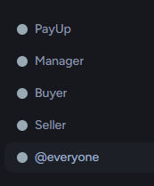

# Setup
This setup page has been carefully created to provide a step by step guide to help you setup and get the most out of PayUp.

If you require further assistance, you should contact support in our [Discord Server ↗](https://discord.gg/vuRx9kJJqg).

## Bot Setup
The first part of using PayUp is to install the bot into your server, and create the relevant roles and channels.

### Inviting the Bot
First of all, we need to [invite the bot ↗](https://discord.com/oauth2/authorize?client_id=1292577670164516934). This will install the bot into your server with the permissions it needs. Once we have invited the bot, we can move on to creating our roles and channels the bot needs.

### Role Setup
Lets begin with our roles. PayUp uses 3 roles: **manager, seller and buyer**. These will be referred to as the **3 key roles**. A quick breakdown can be found below:

| Role | Description |
| ---- | ----------- |
| Manager | Permitted to create products |
| Seller | Permitted to prompt users to purchase products |
| Buyer | Automatically assigned role for completed transactions |

In order for PayUp to successfully assign these roles to people, the automatically created `PayUp` role must be above the 3 key roles.

An example of a good role setup can be seen below:

Once we have done the roles, we can move on to the channels.

### Channel Setup
PayUp only requires 1 channel, which is used for logging purposes. We recommend to keep this private to Sellers and/or Managers, as it may contain sensitive information about transactions.

You can view the recommended permission setup below:

| Role | Permissions | 
| ---- | ----------- |
| PayUp | View Channel, Send Messages, Attach Files |
| Manager | View Channel |
| Seller | View Channel |
| @everyone | View Channel ❌, Send Messages ❌ |

Now we have completed this step, we can move on to our Payment Processors.

To skip directly to a section, press one of the following:

[:fontawesome-brands-stripe-s: Stripe Setup](#stripe-setup){ .md-button }
[:fontawesome-brands-paypal: PayPal Setup](#paypal-setup){ .md-button }

## :fontawesome-brands-stripe: Stripe Setup

### Account Creation
The first step to using Stripe is [creating your account ↗](https://dashboard.stripe.com/register). This will allow us to interact with Stripe and handle payments for your business. Once you have created your account, you need to [activate your account ↗](https://dashboard.stripe.com/account/onboarding) so you can take live payments.
A full, detailed guide for creating your account has been made by Stripe to assist in this process. You can [view it here ↗](https://docs.stripe.com/get-started/account)!

### Getting your Keys
Great! Now that we have the account creation out of the way, we can move on to getting your keys. These keys will allow us ("PayUp") to interact with your Stripe account and handle your payments. In order to fetch your keys, we need to do the following:

#### Retrieving Test Key
To retreive your test key, you need to enable Test mode which can be toggled at the top of your [Stripe Dashboard ↗](https://dashboard.stripe.com).
Once Test mode is enabled, you should see a 'For developers' section on the Home Page of your Test Dashboard. Press the eye next to the Secret key, and note the Secret key down as we will need it later.

#### Retrieving Live Keys
Once we have our test key, we now need to get our Live keys. To access these, we first need to disable Test mode. Once that is done, you will see a Publishable key and Secret key on the 'For developers' part of the Home Page on your Live Dashboard. Note both of these down, as we will be needing them later.

### Configuring Stripe
Great! Now that we have all the information we need, we can move back to our Discord Server and configure Stripe. We advise you to complete the following steps in a private channel, restricted to yourself and those you trust as sensitive information may be disclosed.

In your private channel, type `/setup set-stripe`. This should display a command above the chat box. Press ++tab++ to load the command into your chat, and fill out the `secret_key` (live mode, secret key) and `test_key` (test mode, secret key) fields. Once that is done, press enter to run the command.

Almost there! Just one more command to run. Once you have set your Stripe credentials, execute this command: `/setup toggle-stripe enabled:True`. If you are not planning on configuring PayPal Support, then [click here ↗](#final-steps) to go directly to the final steps.

## :fontawesome-brands-paypal: PayPal Setup
!!! info
	PayPal is known to be more 'pushy' when requesting legal documents, and Stripe may be an easier alternative than PayPal.
!!! example "In Development"
	PayPal Support is in development and not currently recommended for production usage.

### Account Creation
In order to use PayPal, you must first [create a business account ↗](https://www.paypal.com/uk/webapps/mpp/account-selection). On the account creation page, you must select **Business** else you will not be able to interact with PayUp. Fill out the required information, and then proceed onto the next steps.
A full, detailed guide for creating your account has been made by PayPal to assist in this process. You can [view it here ↗](https://www.paypal.com/uk/brc/article/how-to-open-a-paypal-business-account)!

### Getting your Credentials
Amazing! Now that our account is created, we can [visit the developer dashboard ↗](https://developer.paypal.com/dashboard/) and retrieve our credentials. Once logged in, visit the '**Apps & Credentials**' tab and press **Create App**. Set the app name to 'PayUp', or something easily recognisable.

Once you have created your app, copy and note down both the Client ID and Secret as we will be needing them later on.

!!! warning
	When pressing create app, ensure you are toggled into Live Mode else PayUp **will not** function properly.

### Configuring PayPal
Now that we have obtained all our credentials, we can switch to our Discord Server and configure PayPal. We strongly advise you complete the following steps in a private channel, restricted to yourself and those you trust as sensitive information may be disclosed.

In your private channel, type `/setup set-paypal`. This should display a command above the chat box. Press ++tab++ to load the command into your chat, and fill out the `client_id` and `client_secret` fields. Once filled in, press enter to execute the command.

Almost there! Just one more command to run. Once you have set your PayPal credentials, execute this command: `/setup toggle-paypal enabled:True`. Now we can move on to the final steps!

## Final Steps
Now our payment providers are configured, we are 75% of the way ready to a functioning store!
!!! info
	This section is yet to be filled.